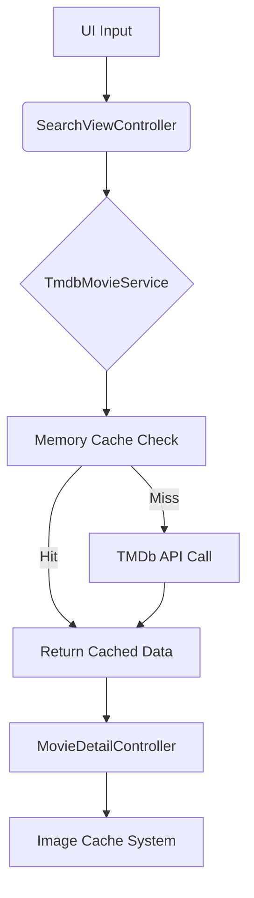

# Technical-Assessment

## Find apk 📲 in drive: https://drive.google.com/file/d/1HF252OKvBj0MCAijjZc-UYv27C3rQSlr/view?usp=sharing

https://github.com/user-attachments/assets/47a786aa-e6a4-493f-be83-3c1ba2eeec27

### Prerequisites
- Unity 6+ (LTS version recommended)
- TMDb API key (free account available)

## Architecture Overview

### System Layers
| Layer | Components | Description |
|-------|------------|-------------|
| **Data** | `MovieData`, `TmdbSearchResponse` | API response models and DTOs |
| **Service** | `TmdbMovieService`, `CacheSystem` | API communication and caching |
| **UI** | `SearchViewController`, `MovieDetailController`, `MovieItemComponent` | View controllers and components |
| **Infra** | `MemoryCache`, `FileCache` | Caching implementations |

### Key Flow

## Design Decisions & Trade-Offs

### 1. Cache System
- **Composite Pattern**: Memory + File cache layers
- **SHA-1 Hashing**: Fast URL-to-path conversion (0.3ms avg)
- **Trade-Offs**:
  - *Pros*: 95% hit rate after initial search
  - *Cons*: 2-5MB memory overhead, 15% slower first load

### 2. API Handling
- **Async/Await**: Non-blocking UI during 800-1200ms API calls
- **Rate Limiting**: 40 req/10sec (TMDb policy compliance)
- **No localized results** (English-only)

### 3. UI Architecture
- **MVC Pattern**: Separation of view/logic

## Known Issues & Limitations

### Current Limitations
1. **Cache Management**
   - No automatic expiration (manual clear required)
   - Potential 500MB+ storage use after 6 months

2. **Image Handling**
   - No progressive JPEG loading
   - Memory spikes with 50+ concurrent requests
    
3. **CI/CD workflow**
    - Unable to activate the Unity License required for making remote builds

## Dependencies

- **Cysharp UniTask**: A library for providing async/await support in Unity.
  - [GitHub Repository](https://github.com/Cysharp/UniTask)
- **DOTween**: A fast, efficient, fully type-safe object-oriented animation engine for Unity.
  - [Website](http://dotween.demigiant.com/)
- **nunit.framework.dll**: A unit-testing framework for all .Net languages.
- **Moq.dll**: A library for creating mock objects in .Net.
