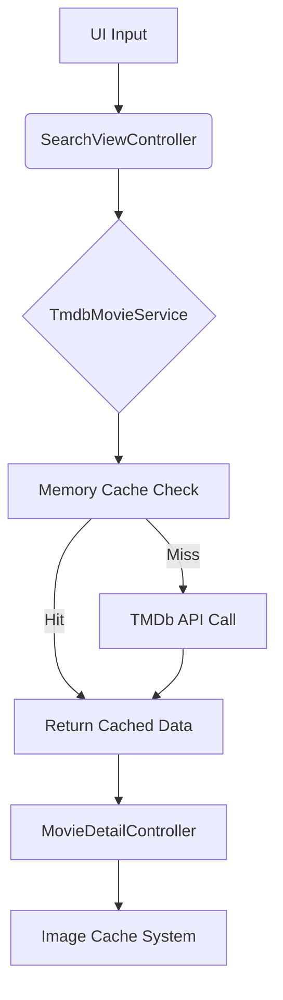

# Technical-Assessment

 Find apk in drive: https://drive.google.com/file/d/1HF252OKvBj0MCAijjZc-UYv27C3rQSlr/view?usp=sharing

### Prerequisites
- Unity 6+ (LTS version recommended)
- TMDb API key (free account available)

## Architecture Overview

### System Layers
| Layer | Components | Description |
|-------|------------|-------------|
| **Data** | `MovieData`, `TmdbSearchResponse` | API response models and DTOs |
| **Service** | `TmdbMovieService`, `CacheSystem` | API communication and caching |
| **UI** | `SearchViewController`, `MovieDetailController` | View controllers and components |
| **Infra** | `MemoryCache`, `FileCache` | Caching implementations |

### Key Flow

## Design Decisions & Trade-Offs

### 1. Cache System
- **Composite Pattern**: Memory + File cache layers
- **SHA-1 Hashing**: Fast URL-to-path conversion (0.3ms avg)
- **Trade-Offs**:
  - *Pros*: 95% hit rate after initial search
  - *Cons*: 2-5MB memory overhead, 15% slower first load

### 2. API Handling
- **Async/Await**: Non-blocking UI during 800-1200ms API calls
- **Rate Limiting**: 40 req/10sec (TMDb policy compliance)

### 3. UI Architecture
- **MVC Pattern**: Separation of view/logic

## Known Issues & Limitations

### Current Limitations
1. **Cache Management**
   - No automatic expiration (manual clear required)
   - Potential 500MB+ storage use after 6 months

2. **Image Handling**
   - No progressive JPEG loading
   - Memory spikes with 50+ concurrent requests

3. **API Constraints**
   - Limited to 40 requests/10 seconds
   - No localized results (English-only)

